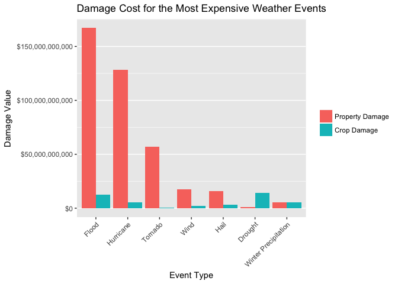
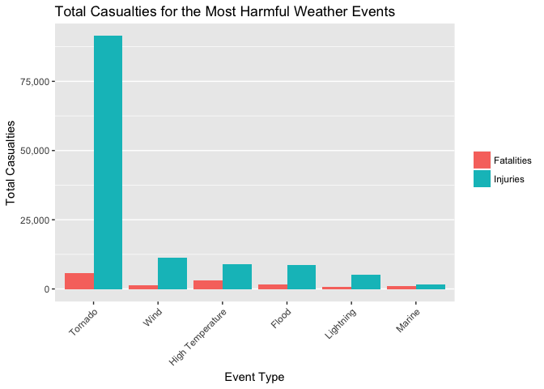

# Storm Data Analysis
Philip Bulsink  

##Synopsis
National Climactid Data Center information on significant weather events and natural disasters. This data includes information on the events with their total damage (property and crop) and injury and fatality information, amonst additional information. This report will show which events have the largest financial and public health impacts on American society.


##Introduction
From the fifties through to the present day the National Climactic Data Center (NCDC) collected data about sever weather and natural events occuring throughout the United States. The dataset for this report comes by compilation of data from 124 regional sites of the National Weather Service (NWS). This weather information was collected from sites across the nation and preprocessed and available online in various locations, including (here)[https://www.ncdc.noaa.gov/stormevents/ftp.jsp].

##Data Processing
The dataset for this report underwent some pre-processing by the NCDC, for example, to convert verbal locations to approximate latitude and longidtude of events. 

The data can be read in as seen in the code below. This is a large dataset, the data reading takes quite some time. For this reason, this step has the cache set to true to speed further analysis. In this study, we are answering two questions (discussed in the _Introduction_ section), and will not need to keep most of the data imported. Reducing the data size will speed up processing.


```r
stormData <- read.csv("repdata-data-StormData.csv.bz2")
evtypes <- length(unique(stormData$EVTYPE))
```

There are many more event types (985 in total) than are easy to manage, so they can be collected. There may be differences due to plurality, such as `Wind` and `Winds`, or short forms `TSTM` vs `Thunderstorms`. Well collect all of the similar types as follows:


```r
stormData$EVENT <- NA
stormData$EVENT[grep("marine|surf|wave|sea|tsunami|waterspout|tide|current|erosi|seiche|coast|swell|water spout|wayter", 
    stormData$EVTYPE, ignore.case = TRUE)] <- "Marine"
stormData$EVENT[(is.na(stormData$EVENT) & grepl("dust", stormData$EVTYPE, ignore.case = TRUE))] <- "Dust"
stormData$EVENT[(is.na(stormData$EVENT) & grepl("drought|dry|dri", stormData$EVTYPE, 
    ignore.case = TRUE))] <- "Drought"
stormData$EVENT[(is.na(stormData$EVENT) & grepl("volcan", stormData$EVTYPE, 
    ignore.case = TRUE))] <- "Volcanic Action"
stormData$EVENT[(is.na(stormData$EVENT) & grepl("fire|smoke", stormData$EVTYPE, 
    ignore.case = TRUE))] <- "Fire and Smoke"
stormData$EVENT[(is.na(stormData$EVENT) & grepl("wind|microburst|wnd|downburst|turbulence", 
    stormData$EVTYPE, ignore.case = TRUE))] <- "Wind"
stormData$EVENT[(is.na(stormData$EVENT) & grepl("snow|freezing rain|sleet|mixed|freezing drizzle|blizzard|ice storm", 
    stormData$EVTYPE, ignore.case = TRUE))] <- "Winter Precipitation"
stormData$EVENT[(is.na(stormData$EVENT) & grepl("hail", stormData$EVTYPE, ignore.case = TRUE))] <- "Hail"
stormData$EVENT[(is.na(stormData$EVENT) & grepl("light|lignt", stormData$EVTYPE, 
    ignore.case = TRUE))] <- "Lightning"
stormData$EVENT[(is.na(stormData$EVENT) & grepl("avalan|slide|slump", stormData$EVTYPE, 
    ignore.case = TRUE))] <- "Land/Mudslide and Avalanche"
stormData$EVENT[(is.na(stormData$EVENT) & grepl("fog|vog", stormData$EVTYPE, 
    ignore.case = TRUE))] <- "Fog"
stormData$EVENT[(is.na(stormData$EVENT) & grepl("flood|urban|floy|fld|stream|high water|rising water|dam fail|dam bre|flash", 
    stormData$EVTYPE, ignore.case = TRUE))] <- "Flood"
stormData$EVENT[(is.na(stormData$EVENT) & grepl("rain|heavy|torrential|precipitation|wet", 
    stormData$EVTYPE, ignore.case = TRUE))] <- "Rains"
stormData$EVENT[(is.na(stormData$EVENT) & grepl("hurric|typhoon|surge", stormData$EVTYPE, 
    ignore.case = TRUE))] <- "Hurricane"
stormData$EVENT[(is.na(stormData$EVENT) & grepl("tropical", stormData$EVTYPE, 
    ignore.case = TRUE))] <- "Tropical Storm"
stormData$EVENT[(is.na(stormData$EVENT) & grepl("nado|funnel|landspout|rotating|wall cloud|tornd", 
    stormData$EVTYPE, ignore.case = TRUE))] <- "Tornado"
stormData$EVENT[(is.na(stormData$EVENT) & grepl("heat|high temperature|warm|hot|record high|excessive", 
    stormData$EVTYPE, ignore.case = TRUE))] <- "High Temperature"
stormData$EVENT[(is.na(stormData$EVENT) & grepl("frost|flash freeze|freeze$", 
    stormData$EVTYPE, ignore.case = TRUE))] <- "Frost/Freeze"
stormData$EVENT[(is.na(stormData$EVENT) & grepl("cool|cold|unseason|low temp|record low", 
    stormData$EVTYPE, ignore.case = TRUE))] <- "Cold Temperature"
stormData$EVENT[(is.na(stormData$EVENT) & grepl("thunder|tstm|tsto|storm", stormData$EVTYPE, 
    ignore.case = TRUE))] <- "Thunderstorm"
stormData$EVENT[(is.na(stormData$EVENT) & grepl("wint|ice|icy|freezing", stormData$EVTYPE, 
    ignore.case = TRUE))] <- "Winter Weather"
stormData$EVENT[(is.na(stormData$EVENT) & grepl("ice|icy|glaze", stormData$EVTYPE, 
    ignore.case = TRUE))] <- "Ice"
stormData$EVENT[(is.na(stormData$EVENT) & grepl("hypothermia|exposure", stormData$EVTYPE, 
    ignore.case = TRUE))] <- "Hypothermia/Exposure"
stormData$EVENT[(is.na(stormData$EVENT) & grepl("temperature|record", stormData$EVTYPE, 
    ignore.case = TRUE))] <- "Abnormal Temperature"
stormData$EVENT[(is.na(stormData$EVENT))] <- "Other"

stormData$EVENT <- as.factor(stormData$EVENT)
numEvents <- length(unique(stormData$EVENT))
```

This has brought us down to 25 events, simplifying further analysis in future areas. Having gathered a reduced data set, in `stormData`, we can start reducing the size of the data and analyzing it to answer the pending questions. If we chop the dataset by health and damage only categories, and drop anything without relevant data (for example, damage = 0), then the remainder of the analysis will be simple


```r
healthData <- subset(stormData, INJURIES > 0 | FATALITIES > 0)
healthData <- healthData[, names(healthData) %in% c("EVENT", "FATALITIES", "INJURIES")]
damageData <- subset(stormData, PROPDMG > 0 | CROPDMG > 0)
damageData <- damageData[, names(damageData) %in% c("EVENT", "PROPDMG", "PROPDMGEXP", 
    "CROPDMG", "CROPDMGEXP")]
```


When adding damage costs together, we are looking at combining `DMG` amounts and `DMGEXP` factors. There seems to be the following pattern in the data:
```
h,H = 100 (hundred)
k,K = 1,000 (thousand)
m,M = 1,000,000 (million)
b,B = 1,000,000,000 (billion)
```
Sometimes there's numbers, or `+` or `-` values instead of the characters. Numbers are character split values, for example, a `DMG` value of 15 and a `EXP` value of 8 would be a total value of $158. Plus and minus are qualifiers for estimates, they'll be dropped in this analysis. 

Transforming the letters to actual amounts requires a function:

```r
valueExp <- function(dmg) {
    if (is.na(dmg)) {
        return(0)
    }
    dmg <- paste0("0", dmg)
    dmgExp <- tolower(substr(dmg, nchar(dmg), nchar(dmg)))
    dmg <- as.numeric(substr(dmg, 1, nchar(dmg) - 1))
    if (dmgExp == "h") {
        dmg <- dmg * 100
    } else if (dmgExp == "k") {
        dmg <- dmg * 1000
    } else if (dmgExp == "m") {
        dmg <- dmg * 1e+06
    } else if (dmgExp == "b") {
        dmg <- dmg * 1e+09
    } else if (dmgExp == "+" | dmgExp == "-") {
        dmg <- dmg
    } else if (dmgExp != "?") {
        dmg <- as.numeric(paste0(dmg, dmgExp))
    } else {
        dmg <- dmg
    }
    if (is.na(dmg)) {
        # Catch in case of non-normal input
        dmg <- 0
    }
    return(dmg)
}
```

We can apply the above function to the damage data to get a dollar amount. This is a long process, even after significant optimization steps. Most systems will still take on the order of a few seconds to a minute to perform this analysis. We can then drop the separated damage values and just hang onto the costs by event.


```r
damageData["PROPDAMAGE"] <- paste0(damageData$PROPDMG, damageData$PROPDMGEXP)
damageData["CROPDAMAGE"] <- paste0(damageData$CROPDMG, damageData$CROPDMGEXP)
damageData["PROPDAMAGE"] <- sapply(damageData$PROPDAMAGE, function(x) valueExp(x))
damageData["CROPDAMAGE"] <- sapply(damageData$CROPDAMAGE, function(x) valueExp(x))

damageData <- damageData[, names(damageData) %in% c("EVENT", "PROPDAMAGE", "CROPDAMAGE")]
```

Now that that's done, we can finish our data preparation with some melting and casting using the popular `reshape2` package. This will sum up each type of weather event's health impact (fatalities and injuries) or damage costs (crops or property) and combine them in an easy to read format. Well also forget about all the types of weather that didn't cause damage or have health impacts. 


```r
library(reshape2)
healthData <- melt(healthData, id.var = c("EVENT"))
healthData <- dcast(healthData, EVENT ~ variable, sum)
healthEV <- length(unique(healthData$EVENT))
damageData <- melt(damageData, id.var = "EVENT")
damageData <- dcast(damageData, EVENT ~ variable, sum)
damageData <- droplevels(damageData)
damageEV <- length(unique(damageData$EVENT))
```

##Results
There are 25 types of storm data categories, some of which have a much larger impact on the economy and population health than others. Some of these are innocent though, with only 23 distinct events causing damage, and 23 distinct events having an impact on population health and mortality. 

The total cost of damage to property and crops by all storms can be calculated:

```r
propertyDamage <- sum(damageData$PROPDAMAGE, na.rm = TRUE)
cropDamage <- sum(damageData$CROPDAMAGE, na.rm = TRUE)
damageData$TOTALDAMAGE <- rowSums(damageData[, names(damageData) %in% c("PROPDAMAGE", 
    "CROPDAMAGE")])
totalDamage <- sum(propertyDamage, cropDamage)
fatalities <- sum(healthData$FATALITIES, na.rm = TRUE)
injuries <- sum(healthData$INJURIES, na.rm = TRUE)
healthData$CASUALTIES <- rowSums(healthData[, names(healthData) %in% c("INJURIES", 
    "FATALITIES")])
totalCasualties <- sum(fatalities, injuries)
```

From all of the events collected we can see that the total property damgage was $427318720451, and the total crop damage was $49104194521, for a grand total of $476422914972 lost in weather events. Similarly, there were 140528 injuries in events, and 15145 fatalities in the weather events.

Digging into the damage and health cost by event type reveals the most significant impacts on society. 


```r
proplist <- head(damageData[order(-damageData$PROPDAMAGE), ], 5)
croplist <- head(damageData[order(-damageData$CROPDAMAGE), ], 5)
totallist <- droplevels(unique(rbind(proplist, croplist)))
```

From this, the most expensive events for property are Flood, Hail, Hurricane, Tornado and Wind, while the most damaging for crops are Drought, Flood, Hail, Hurricane and Winter Precipitation. The overall most expensive events are Drought, Flood, Hail, Hurricane, Tornado, Wind and Winter Precipitation.

We can visualize this information to see the event types and their cost in the following plot:

```r
library(ggplot2)
library(scales)
dmglist <- droplevels(unique(rbind(proplist, croplist)))
dmglist$EVENT <- factor(dmglist$EVENT, levels = dmglist[order(-dmglist$TOTALDAMAGE), 
    ]$EVENT)
dmglist <- subset(dmglist, select = -c(TOTALDAMAGE))
dmglist <- melt(dmglist, id.vars = "EVENT")
ggplot(dmglist, aes(x = dmglist$EVENT, y = dmglist$value)) + geom_bar(stat = "identity", 
    position = "dodge", aes(fill = dmglist$variable)) + xlab("Event Type") + 
    theme(axis.text.x = element_text(angle = 45, vjust = 1, hjust = 1), panel.grid.minor.x = element_blank(), 
        panel.grid.major.x = element_blank()) + ylab("Damage Value") + ggtitle("Damage Cost for the Most Expensive Weather Events") + 
    scale_fill_discrete(breaks = c("PROPDAMAGE", "CROPDAMAGE"), labels = c("Property Damage", 
        "Crop Damage"), name = "") + scale_y_continuous(labels = dollar)
```



Similarly, we can analyze the data to discern the largest population health impact. 

```r
injurylist <- head(healthData[order(-healthData$INJURIES), ], 5)
fatalitylist <- head(healthData[order(-healthData$FATALITIES), ], 5)
casualtylist <- unique(rbind(injurylist, fatalitylist))
```

Therefore, the most fatal events are Flood, High Temperature, Marine, Tornado and Wind, while the events with the most injuries are Flood, High Temperature, Lightning, Tornado and Wind. The highest number of total casualties is in Flood, High Temperature, Lightning, Marine, Tornado and Wind.


```r
healthlist <- droplevels(unique(rbind(injurylist, fatalitylist)))
healthlist$EVENT <- factor(healthlist$EVENT, levels = healthlist[order(-healthlist$CASUALTIES), 
    ]$EVENT)
healthlist <- subset(healthlist, select = -c(CASUALTIES))
healthlist <- melt(healthlist, id.vars = "EVENT")
ggplot(healthlist, aes(healthlist$EVENT, healthlist$value)) + geom_bar(stat = "identity", 
    position = "dodge", aes(fill = healthlist$variable)) + xlab("Event Type") + 
    theme(axis.text.x = element_text(angle = 45, vjust = 1, hjust = 1), panel.grid.minor.x = element_blank(), 
        panel.grid.major.x = element_blank()) + ylab("Total Casualties") + ggtitle("Total Casualties for the Most Harmful Weather Events") + 
    scale_fill_discrete(breaks = c("FATALITIES", "INJURIES"), labels = c("Fatalities", 
        "Injuries"), name = "") + scale_y_continuous(labels = comma)
```



##Conclusion

In conclusion, the most expensive events are Drought, Flood, Hail, Hurricane, Tornado, Wind, Winter Precipitation, and the most damaging to population health are Flood, High Temperature, Lightning, Marine, Tornado, Wind.
